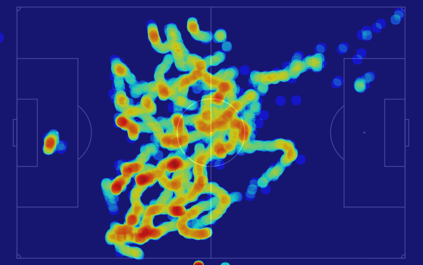
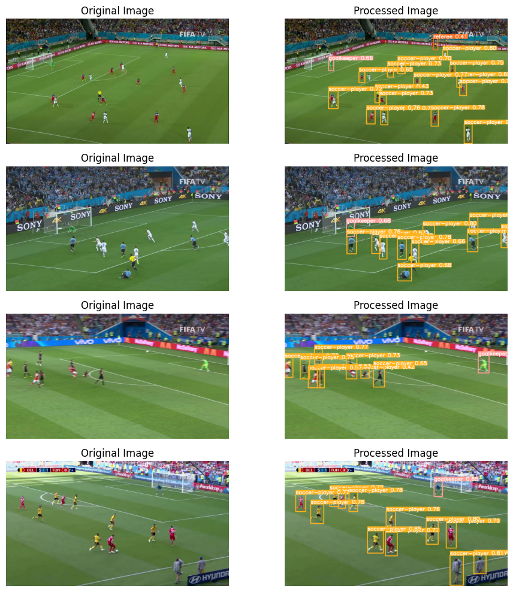
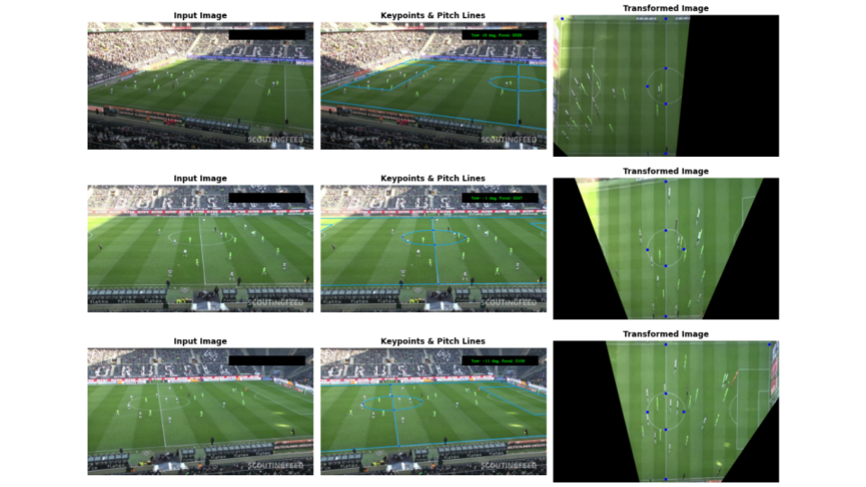

# Soccer Players Analysis System

## Introduction
This repository introduces a prototype computer vision system specifically tailored for the analysis of soccer players within images and videos. It serves as a foundational Proof of Concept (PoC) that leverages the latest in object detection technology, YOLOv8, to detect and track players, categorize them by team colors, and map their movements onto a 2D representation of the soccer field. The system integrates three core components:

- **Player Detection and Tracking**: Harnesses the power of YOLOv8 to identify and follow player movements, providing a basis for real-time and post-match analysis.
- **Team Classification**: Uses color segmentation to differentiate teams, a crucial step for detailed team-based analytics.
- **Field Homography**: Employs keypoints extraction and Perspective-n-Point (PnP) matching algorithms for accurate projection of player positions onto a soccer field layout.

As an initial PoC, this system establishes a solid groundwork for future enhancements. It demonstrates the feasibility and potential of using advanced computer vision techniques in sports analytics. Future developments will focus on improving accuracy, efficiency, and the range of analytical tools available, aiming to offer more comprehensive insights into game dynamics, player performance, and team strategies. This project is a stepping stone towards revolutionizing how we understand and enjoy soccer, offering a glimpse into the future of sports analytics.


## Table of Contents
- [Installation](#installation)
- [Usage](#usage)
- [Demo](#demo)
- [Notebooks](#notebooks)
- [Scripts](#scripts)
- [Future Work](#future-work)


## Installation

To set up and run the Soccer Players Analysis System on your local machine, follow these steps:

### Prerequisites

- Ensure you have [Anaconda](https://www.anaconda.com/products/individual) or [Miniconda](https://docs.conda.io/en/latest/miniconda.html) installed on your system. These platforms include Conda, which is necessary for creating and managing the project environment.

### Cloning the Repository

First, clone the repository to your local machine using Git. Open a terminal or command prompt and run the following command:

```bash
git clone git@github.com:yskaaks/soccer-analytics.git
cd soccer-players-analysis
```
Where `soccer-players-analysis` should be the path to the directory where the repository was cloned in your local machine.

### Creating the Conda Environment

Create a new Python 3.11 environment by running:

```bash
conda create -n soccer-env python=3.11
```

### Activating the Environment

Activate the newly created environment with:

```bash
conda activate soccer-env
```

### Installing PyTorch

Install PyTorch based on your system's specifications. Use the tool from PyTorch's [Get Started](https://pytorch.org/get-started/locally/) page to find the appropriate command for your setup. For instance, if you are using CUDA 11.8, the command might look like this:

```bash
pip install torch torchvision torchaudio --index-url https://download.pytorch.org/whl/cu118
```

This installation may take some time.

### Installing Ultralytics YOLOv8

Install the Ultralytics package to use YOLOv8, which also takes care of installing the required OpenCV library:

```bash
pip install ultralytics
```

This step can also take some time.

### Testing the Installation

To test the installation, change to the following directory:

```bash
cd soccer-players-analysis/Usage/soccer-analytics/src
```

And run the demo script:

```bash
python demo.py
```

After running, Ultralytics will auto-update, and then a window should be displayed with a 2x2 grid of the available outputs of the soccer analysis, indicating a successful installation.

Congratulations! You have successfully set up the Soccer Players Analysis System on your local machine.

## Usage

This section details the steps to analyze a soccer game video using the Soccer Players Analysis System. The process involves setting color filters for team segmentation, running the analysis, and reviewing the outputs, including heatmaps for both teams.

### Step 1: Navigate to the Project's Source Directory

Open a terminal window and navigate to the source directory of the project:

```bash
cd soccer-players-analysis/Usage/soccer-analytics/src
```

### Step 2: Run the Analysis Script

Execute the `main.py` script with the `--input_video_path` argument pointing to the absolute path of your desired video file. This ensures the script correctly locates and processes the video:

```bash
python main.py --input_video_path "path/to/desired/video.mp4"
```

Replace `"path/to/desired/video.mp4"` with the actual path to your video.

### Step 3: Set HSV Color Filters for Team Segmentation

Upon running the script, a window will appear displaying two sample frames from the video (the first and middle frames) alongside sliders for manually setting the min and max HSV values to create custom filters for each team's colors.

#### 3.1 Segment Team 1

Adjust the sliders to accurately segment the jerseys of one team, which will be assigned as Team 1. Once satisfied with the segmentation, press the `y` key to save the color range.

#### 3.2 Segment Team 2

The segmentation mask will reset, allowing you to set parameters for the second team. Adjust the sliders until achieving the desired results, and press `y` again to save.

#### 3.3 Save HSV Ranges

The HSV ranges for both teams will be saved to `soccer-players-analysis/Usage/soccer-analytics/outputs/(name-of-the-input-video)/hsv_ranges.txt`, allowing for reuse in future analyses of the same video.


### Step 4: Review Processing Progress

While the frames are being processed, a progress window will appear alongside a progress bar. This window displays a 2x2 grid with the following information for each frame:

- **Upper Left**: Frame with YOLOv8 detections
- **Upper Right**: Location of players in 2D layout
- **Lower Left**: Heatmap for Team 1
- **Lower Right**: Heatmap for Team 2

### Step 5: Access Final Outputs

The final outputs are stored in `soccer-players-analysis/Usage/soccer-analytics/outputs/(name-of-the-input-video)` and include:

- **composite_video.mp4**: The composite video shown in the processing window
- **overlay_heatmap_team_1.png**: The final heatmap for Team 1
- **overlay_heatmap_team_2.png**: The final heatmap for Team 2



These outputs provide comprehensive visual analytics of player movements and team dynamics throughout the game.

## Demo

The demo section provides a practical guide to running the Soccer Players Analysis System with the `main.py` script. This script showcases the system's capabilities, including player detection, tracking, team classification, and field homography, using computer vision techniques.


### Getting Started

Before running the demo, ensure you've followed the [Installation](#installation) instructions to set up the necessary environment and dependencies.

### Basic Demo Usage

To run the demo with a custom video, navigate to the demo directory and execute the `main.py` script, specifying the path to your video. This example uses the default parameter values except for the input video path:

```bash
cd soccer-players-analysis/Usage/soccer-demo/src
python main.py --input_video_path "path/to/your/video.mp4"
```

Replace `"path/to/your/video.mp4"` with the actual path to your video file.

### Advanced Demo Usage

For a more customized analysis, you can specify additional parameters. The following command demonstrates how to change all available parameters, tailoring the analysis to your specific requirements:

```bash
cd soccer-players-analysis/Usage/soccer-demo/src
python main.py --input_video_path "path/to/your/video.mp4" --player_labels 2 3 --ball_labels 1 --n_classes 2 --input_layout_image "path/to/layout/image.png" --yolo_model_path "path/to/yolo/model/best.pt" --output_base_dir "path/to/outputs"
```

Make sure to replace the placeholder paths and values with those relevant to your setup.

### What to Expect

- **Player Detection and Tracking**: The system uses YOLOv8 for detecting and tracking players, highlighted by bounding boxes.
- **Team Classification**: Teams are classified based on jersey colors. This is visualized by the color of the bounding boxes around players.
- **Field Homography**: Players' positions are mapped onto a 2D soccer field layout, demonstrating the system's ability to analyze spatial dynamics.
- **Outputs**: The demo saves various outputs, including processed videos, heatmaps, and tracking data, to the specified output directory.


## Notebooks
The Jupyter notebooks within the `Notebooks` directory guide users through leveraging the system's functionalities for a comprehensive analysis of soccer players:

### Object Detection
- **`inference-yolov8-player-detection.ipynb`**: Showcases the process of detecting soccer players in images using the pretrained YOLOv8 model, enriched with visual illustrations. 

### Object Tracking
- **`inference-yolov8-player-tracking.ipynb`**: Details the methodology for tracking players across video sequences, highlighting the seamless integration of detection and tracking technologies.

### Soccer Field Homography
- **`field-homography-opencv-features-v1.ipynb`**: Introduces the task of mapping soccer field homography, employing OpenCV's feature extraction methods and automatic matching against a soccer field template. This notebook serves as a first approach to align player positions with a standard soccer field layout, significantly enhancing tactical analysis and visualization capabilities.

### Model Training
- **`training-yolov8-player-detection.ipynb`**: Provided for reference, this notebook offers a comprehensive walkthrough for training the YOLOv8 model with custom datasets, aiding users in enhancing model performance with their data.

## Scripts

The `Scripts` directory houses the core codebase, organized into directories for specific functionalities. Updates include enhancements to the soccer field homography process, introducing advanced methods for field alignment and player positioning.

### players-detection-yolo
Focuses on detecting players using YOLOv8. It processes video inputs to identify players, drawing detections, and saving crops. Outputs are stored in `outputs` with subdirectories for each test video, containing cropped images for further analysis.

  

### players-number-recognition [Deprecated in final integration]
Uses `easyocr` to recognize player numbers from detected player crops. This script processes images to extract text, organizing the results for identification purposes. Outputs include confident crops for high-accuracy recognitions.

### players-tracking-norfair
Implements the system's tracking logic, using Norfair for object tracking, integrated with OpenCV for video processing and YOLOv8 for detection. Outputs include video files and CSVs detailing tracking data.

  

### Soccer Field Homography
- **`soccer-field-homography/extract-layout-points/extract_layout_points_v1.py`**: Facilitates the interactive selection of pivotal points on soccer field images, essential for accurate homography transformations.
- **`soccer-field-homography/classic-approach/src/main_v2.py`**: Employs advanced techniques for camera pose estimation and pitch tracking, offering a refined approach to aligning the real-world soccer field with its digital representation.
- **`soccer-field-homography/classic-optimized-approach/src/main_video_v2.py`**: Optimizes homography transformations for video inputs, maintaining accurate field alignment across dynamic scenes. The script features a `HomographyState` class to manage transformation parameters effectively, ensuring consistent overlay of the soccer field throughout video sequences. This advanced method is pivotal for enhancing the accuracy and efficiency of player tracking and field mapping in videos.




## Future Work

The Soccer Players Analysis System, currently in its prototype phase, has demonstrated significant potential in leveraging computer vision for the analysis of soccer games. Future enhancements are aimed at refining and expanding its capabilities in the following areas:

### Object Detection with YOLOv8
- **Enhanced Model Training**: Prioritize the development of a custom-trained YOLOv8 model, utilizing a comprehensive dataset that distinguishes between players, goalkeepers, and referees. This effort will address the current limitations posed by the pretrained model, such as the misclassification of referees and balls as players, by incorporating a larger, more diverse dataset specifically tailored to the nuances of soccer games.

### Field Homography
- **Deep Learning-Based Approaches**: Integrate advanced deep-learning-based models for field homography to achieve more stable and accurate projections. The exploration of repositories like [sportsfield_release](https://github.com/vcg-uvic/sportsfield_release) and [tvcalib](https://github.com/mm4spa/tvcalib) suggests promising avenues for improvement. While the former offers ease of implementation for immediate development needs, the latter's open-source nature and superior performance make it a preferred choice for long-term scalability and distribution. Efforts will focus on adapting these models to work seamlessly with the latest PyTorch versions compatible with YOLOv8, ensuring a more robust and precise field mapping.

### Players Re-identification
- **Research and Implementation of Advanced Models**: The task of player re-identification presents a unique challenge, necessitating ongoing research and experimentation with state-of-the-art models. Initial findings point towards transformer-based architectures as promising solutions. Dedicated time will be allocated to review, implement, and train models from scratch based on the most relevant and recent research. One such starting point is the work presented in [this article](https://arxiv.org/abs/2206.02373) and its associated [GitHub repository](https://github.com/shallowlearn/sportsreid), which offers a modern approach to sports player re-identification. This endeavor will involve significant GPU resources due to the complex nature of the models and the extensive training required.

The journey ahead for the Soccer Players Analysis System is marked by these ambitious yet achievable goals. By addressing these key areas, the project aims to enhance its analytical capabilities, offering more accurate, reliable, and insightful analyses of soccer games.