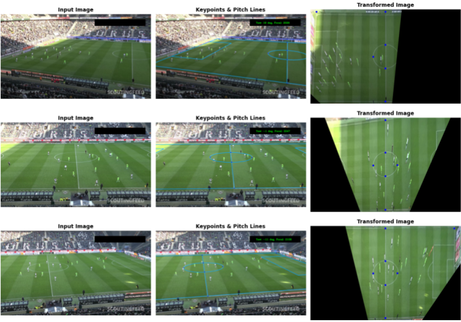

# Soccer Player Analysis System

## Introduction
This system utilizes advanced computer vision techniques, including YOLOv8 for object detection and various algorithms for player tracking, to analyze soccer players in images and videos. It's an invaluable tool for coaches, analysts, and fans, offering detailed insights into player movements and behaviors.

## Table of Contents
- [Installation](#installation)
- [Dependencies](#dependencies)
- [Notebooks](#notebooks)
- [Scripts](#scripts)

## Installation
Ensure Python 3.11.7 is installed on your system, then clone the project repository. Navigate to the project's root directory and install the dependencies from the `requirements.txt` file with:
```bash
pip install -r requirements.txt
```
This setup includes critical libraries such as `ultralytics` for YOLO models, `opencv-python` for image processing, and `norfair` for tracking.

## Dependencies
The system requires several Python libraries, including:
- `ultralytics==8.1.2`
- `opencv-python==4.9.0.80`
- `roboflow==1.1.19`
- `norfair[metrics,video]==2.2.0`
- `jupyter>=1.0.0`, `tqdm>=4.66.1`, `matplotlib>=3.8.2`, `numpy>=1.26.3`

## Notebooks
The Jupyter notebooks in the `Notebooks` directory provide a comprehensive guide to leveraging the system's functionalities for analyzing soccer players:

### Soccer Field Homography
- **`field-homography-opencv-features-v1.ipynb`**: Introduces the task of soccer field homography, utilizing OpenCV's built-in feature extraction methods and automatic matching to a soccer field template. This notebook serves as a first approach to aligning player positions on the field with a standard soccer field layout, enhancing tactical analysis and visualization.

### Object Detection
- **`inference-yolov8-player-detection.ipynb`**: Demonstrates detecting soccer players in images using the pretrained YOLOv8 model, complete with visual examples. 

### Object Tracking
- **`inference-yolov8-player-tracking.ipynb`**: Details the process of tracking players across video sequences, showcasing the integration of detection and tracking technologies.

### Model Training
- **`training-yolov8-player-detection.ipynb`**: Provides step-by-step instructions for training the YOLOv8 model with custom datasets, enabling users to improve model performance with their data.

## Scripts
The `Scripts` directory houses the core codebase, organized into directories for specific functionalities. Updates include enhancements to the soccer field homography process, introducing advanced methods for field alignment and player positioning.

### players-detection-yolo
Focuses on detecting players using YOLOv8. It processes video inputs to identify players, drawing detections, and saving crops. Outputs are stored in `outputs` with subdirectories for each test video, containing cropped images for further analysis.

  

### players-number-recognition
Uses `easyocr` to recognize player numbers from detected player crops. This script processes images to extract text, organizing the results for identification purposes. Outputs include confident crops for high-accuracy recognitions.

### players-tracking-norfair
Implements the system's tracking logic, using Norfair for object tracking, integrated with OpenCV for video processing and YOLOv8 for detection. Outputs include video files and CSVs detailing tracking data.

  

### Soccer Field Homography
- **`soccer-field-homography/extract-layout-points/extract_layout_points_v1.py`**: Enables the interactive selection of key points on soccer field images, facilitating precise homography transformations. This script is crucial for defining exact field dimensions and player positions in the analysis process.

- **`soccer-field-homography/classic-approach/src/main_v2.py`**: Incorporates advanced techniques for camera pose estimation and pitch tracking, offering a sophisticated approach to aligning the real-world soccer field with its digital representation. This version enhances the accuracy of player tracking and field alignment.

  

